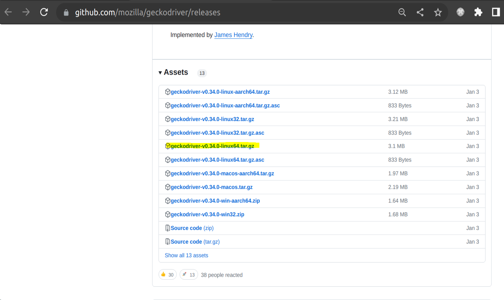
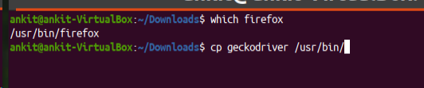

# Robot-Framework-Test-Automation
Test Automation Using Robot Framework Selenium

# Integrate selenium library with firefox (Linux ,Ubuntu)
Download the highligted package from url
https://github.com/mozilla/geckodriver/releases



Untar the package using below command

`tar -xzvf geckodriver-v0.34.0-linux64.tar.gz`

Copy the file **geckodriver** to location of firefox executables



# Getting Started With This framework
To get started, clone this repo, and run `robot -d results tests/crm.robot`  

````
 git clone https://github.com/ankitnayaDa/Robot-Framework-Test-Automation.git
 cd Robot-Framework-Test-Automation/crm/
 robot -d results tests/crm.robot
````

The aforementioned command outputs a test report HTML file in the `/results` location.

# Test Case

1. Loging to UI and create a new user


